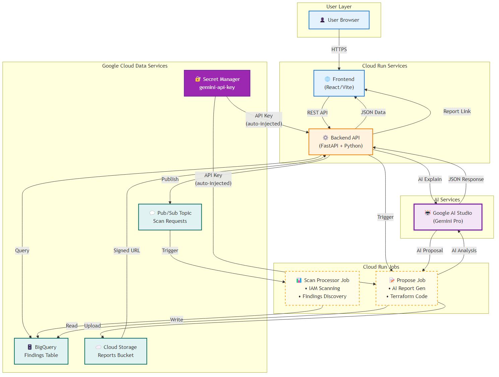

# 🤖 Zero-Trust Explainer (ZTE)

**AI-Powered Security Analysis for Google Cloud Run** — Find risk, explain blast radius, ship least-privilege patches with AI-generated insights and remediation code.

> A comprehensive security scanning and analysis tool for Google Cloud Run services, enhanced with **Google AI Studio** and **Gemini Pro** integration. It helps identify IAM misconfigurations, explains security risks with AI-powered blast radius analysis, and proposes least-privilege fixes with intelligent remediation guides. Built for Google Cloud Run (GKE) Hackathon 🎉

This project demonstrates the power of AI agents, MCP (Model Context Protocol), and intelligent security analysis on Google Cloud Run with production-grade optimizations.

<div align="center">


</div>

---

## 🎯 Features

- 🔍 **Scan Cloud Run Services**: Submit scan requests via REST API to analyze IAM configurations
- 📊 **View Findings**: Query findings from BigQuery with filtering by job ID and severity
- 🤖 **AI-Powered Explanations**: Get intelligent security analysis with blast radius, risk assessment, and business impact
- 🎯 **Smart Risk Prioritization**: AI-driven priority scoring and remediation urgency assessment
- 🛠️ **AI-Generated Fixes**: Automated Terraform/IAM remediation code with step-by-step guides
- 📋 **Executive Summaries**: AI-powered scan summaries with compliance impact and strategic recommendations
- 📁 **Signed Reports**: Generate and access comprehensive security reports via signed GCS URLs
- 🎨 **Modern UI**: React/Vite frontend with AI indicators, job cards, severity filters, and action buttons

---

## 🏗️ Architecture



**Architecture Flow:**
```
User Browser → Frontend (React) → Backend API (FastAPI) → AI Studio (Gemini Pro)
                                                        → Pub/Sub → Scan Job → BigQuery
                                                        → Propose Job → Cloud Storage
                                                        → AI Summary (direct from Backend)
```

> **Note**: The Scan Processor can optionally run as a **Cloud Run Worker Pool** for continuous processing instead of an on-demand Job. See [Architecture Options](#architecture-options) below for details on when to use each approach.

### AI-Powered Backend (FastAPI + Gemini Pro)

- **POST /scan** - Publishes scan requests to Pub/Sub
- **GET /findings/{job_id}** - Retrieves findings from BigQuery with optional severity filtering
- **GET /explain/{id}** - 🤖 AI-powered explanations with blast radius, risk assessment, and business impact
- **GET /summary/{job_id}** - 🤖 AI-generated executive summaries with compliance analysis
- **POST /propose/{job_id}** - 🤖 Triggers Cloud Run Job to generate AI-powered Terraform/IAM fixes
- **GET /jobs** - Lists recent scan jobs with summary statistics

### Frontend (React/Vite)

- 🤖 AI-powered job cards with intelligent severity breakdown
- Advanced filtering by job_id and severity
- Actions: Scan, Refresh, 🤖 AI Explain, 📊 AI Summary, 🤖 AI Propose
- Real-time updates and loading states with AI indicators
- Beautiful modal displays for AI-generated content

### Infrastructure (Terraform)

- **Artifact Registry**: Container image repository
- **Cloud Run Services**: Backend API and Frontend
- **Cloud Run Jobs**: Scan Processor Job (on-demand) and Propose Job (AI-powered fix proposal execution)
- **Cloud Run Worker Pools**: Alternative option for continuous scan processing (see Architecture Options below)
- **Pub/Sub**: Scan request queue
- **BigQuery**: Findings data warehouse
- **GCS Bucket**: Report storage with signed URLs
- **Secret Manager**: Secure storage for Gemini API key
- **Google AI Studio**: Gemini Pro integration for intelligent analysis
  - **Try the prompts in AI Studio:** https://ai.studio/apps/drive/1zJDtAA4MbLprQbdSmbplA0winFyDPV-r

---

## 📋 Prerequisites

- Google Cloud Platform account
- GCP Project with billing enabled
- **Google AI Studio API Key** (for Gemini Pro integration - stored in Secret Manager)
- Terraform >= 1.5
- Docker
- Node.js >= 20 (for local frontend development)
- Python >= 3.11 (for local backend development)

---

## 🚀 Quick Start

### 1. Configure Google AI Studio

1. Visit [Google AI Studio](https://aistudio.google.com/)
2. Create a new API key
3. Copy the API key for use in configuration

### 2. Configure GCP

```bash
# Set your project ID
export GCP_PROJECT_ID="your-project-id"

# Enable required APIs (done automatically by Terraform)
gcloud services enable \
  run.googleapis.com \
  artifactregistry.googleapis.com \
  pubsub.googleapis.com \
  bigquery.googleapis.com \
  storage.googleapis.com \
  secretmanager.googleapis.com
```

### 3. Deploy with Terraform

```bash
cd terraform

# Initialize Terraform
terraform init

# Create terraform.tfvars from example
cp terraform/terraform.tfvars.example terraform/terraform.tfvars

# Edit terraform/terraform.tfvars with your actual values
# Or create it manually using the template below:
cat > terraform/terraform.tfvars <<EOF
project_id = "your-project-id"
region = "us-central1"
backend_image = "us-central1-docker.pkg.dev/your-project-id/zte-repo/backend:latest"
frontend_image = "us-central1-docker.pkg.dev/your-project-id/zte-repo/frontend:latest"
# Optionally provide gemini_api_key for initial Secret Manager setup
# After first deployment, you can remove this line - secret will be stored in Secret Manager
gemini_api_key = "your-ai-studio-api-key"  # 🤖 AI Studio API Key (optional - only for initial secret creation)
EOF

# Plan deployment
terraform plan

# Apply deployment
terraform apply
```

---

## 💻 Local Development

### Prerequisites for Local Development

- Python 3.11+ installed
- Node.js 20+ and npm installed
- GCP credentials configured (`gcloud auth application-default login`)
- Google AI Studio API key
- BigQuery dataset and table created (see Deployment section)

### Backend Development

**Step 1: Create Virtual Environment**

```bash
cd backend
python -m venv venv

# Activate (Linux/Mac)
source venv/bin/activate

# Activate (Windows PowerShell)
venv\Scripts\Activate.ps1

# Activate (Windows CMD)
venv\Scripts\activate.bat
```

**Step 2: Install Dependencies**

```bash
pip install -r requirements.txt
```

**Step 3: Set Environment Variables**

Create a `.env` file in the `backend/` directory:

```bash
# backend/.env
GCP_PROJECT_ID=your-project-id
GEMINI_API_KEY=your-ai-studio-api-key  # Get from https://aistudio.google.com/
PUBSUB_TOPIC=zte-scan-requests
BQ_DATASET=zero_trust_explainer
BQ_TABLE=findings
REPORT_BUCKET=your-project-id-zte-reports
REGION=us-central1
PORT=8080
```

Or export environment variables:

```bash
# Linux/Mac
export GCP_PROJECT_ID="your-project-id"
export GEMINI_API_KEY="your-ai-studio-api-key"
export PUBSUB_TOPIC="zte-scan-requests"
export BQ_DATASET="zero_trust_explainer"
export BQ_TABLE="findings"
export REPORT_BUCKET="your-project-id-zte-reports"
export REGION="us-central1"
export PORT="8080"

# Windows PowerShell
$env:GCP_PROJECT_ID="your-project-id"
$env:GEMINI_API_KEY="your-ai-studio-api-key"
$env:PUBSUB_TOPIC="zte-scan-requests"
$env:BQ_DATASET="zero_trust_explainer"
$env:BQ_TABLE="findings"
$env:REPORT_BUCKET="your-project-id-zte-reports"
$env:REGION="us-central1"
$env:PORT="8080"
```

**Step 4: Run Backend Locally**

```bash
python main.py
```

The backend should start on `http://localhost:8080`

### Frontend Development

**Step 1: Install Dependencies**

```bash
cd frontend
npm install
```

**Step 2: Set Environment Variables**

Create a `.env.local` file in the `frontend/` directory:

```bash
# frontend/.env.local
VITE_API_URL=http://localhost:8080
```

Or export environment variable:

```bash
# Linux/Mac
export VITE_API_URL="http://localhost:8080"

# Windows PowerShell
$env:VITE_API_URL="http://localhost:8080"
```

**Step 3: Run Development Server**

```bash
npm run dev
```

The frontend should start on `http://localhost:3000` (or another port if 3000 is taken)

### Running Both Frontend and Backend

**Terminal 1 - Backend**

```bash
cd backend
source venv/bin/activate  # Or venv\Scripts\activate on Windows
python main.py
```

**Terminal 2 - Frontend**

```bash
cd frontend
npm run dev
```

**Open Browser**

- Frontend: http://localhost:3000
- Backend API: http://localhost:8080

### Troubleshooting Local Development

**Backend won't start**

- Verify all environment variables are set (use `echo $GCP_PROJECT_ID` or `$env:GCP_PROJECT_ID`)
- Check GCP credentials: `gcloud auth application-default login`
- Ensure BigQuery dataset exists: `bq ls gcr-hackathon:zero_trust_explainer`

**Frontend can't connect to backend**

- Verify `VITE_API_URL` points to backend URL (http://localhost:8080)
- Check backend is running on port 8080
- Check browser console for CORS errors

**AI features not working**

- Verify `GEMINI_API_KEY` is correct
- Check AI Studio API key is valid at https://aistudio.google.com/
- Check backend logs for AI-related errors

**BigQuery connection issues**

- Ensure GCP project ID is correct
- Verify BigQuery dataset and table exist
- Check service account has BigQuery permissions

---

## 🔧 Additional Deployment Options

### Manual Frontend Deployment (Quick Testing)

For quick frontend deployments during testing:

```powershell
# Set variables
$projectId = "gcr-hackathon"
$region = "us-central1"
$backendUrl = "https://zte-backend-api-gcr-hackathon.us-central1.run.app"  # Get from terraform output

# Build and push frontend
cd frontend
$imageName = "$region-docker.pkg.dev/$projectId/zte-repo/frontend:latest"
docker build --build-arg "VITE_API_URL=$backendUrl" -t $imageName .
docker push $imageName

# Deploy to Cloud Run
gcloud run deploy zte-frontend `
    --image $imageName `
    --region $region `
    --project $projectId `
    --allow-unauthenticated `
    --platform managed `
    --set-env-vars "VITE_API_URL=$backendUrl" `
    --memory 512Mi `
    --cpu 1 `
    --timeout 300 `
    --max-instances 5 `
    --min-instances 0

cd ..
```

### GitHub Actions CI/CD Setup

**Quick Setup (Recommended):**

1. **Run setup script:**

```bash
# Unix/Mac
export GCP_PROJECT_ID="your-project-id"
./scripts/setup-cicd.sh

# Windows PowerShell
$env:GCP_PROJECT_ID = "your-project-id"
.\scripts\setup-cicd.ps1
```

2. **Add GitHub Secrets:**

   - Go to **GitHub Repository** → **Settings** → **Secrets and variables** → **Actions**
   - Add `GCP_PROJECT_ID`: Your project ID
   - Add `GCP_SA_KEY`: Contents of `github-actions-key.json` (from setup script)
   - Add `GEMINI_API_KEY`: (Optional) Your API key (only for initial Secret Manager setup)

   **Optional - Quick Links URLs** (for frontend header):

   - `DEMO_VIDEO_URL`: URL to demo video
   - `REPO_URL`: URL to GitHub repository
   - `ARCH_URL`: URL to architecture diagram
   - `AI_STUDIO_URL`: URL to AI Studio prompts/app

3. **Deploy:**

```bash
git push origin main
```

**Manual Setup** (if you prefer to do it manually):

```bash
# See docs/CICD_SETUP.md for detailed instructions
# Or docs/CICD_SETUP_QUICKSTART.md for quick reference
```

> **Note**: The API key is stored in GCP Secret Manager after first deployment. After that, you can remove `GEMINI_API_KEY` from GitHub Secrets.

**Quick Links Configuration**: To display quick links in the frontend header (Video, Repo, Architecture, AI Studio), add these optional GitHub Secrets:
- `DEMO_VIDEO_URL`: URL to demo video
- `REPO_URL`: URL to GitHub repository
- `ARCH_URL`: URL to architecture diagram
- `AI_STUDIO_URL`: URL to AI Studio prompts/app

These URLs will be automatically injected into the frontend at runtime. See `docs/DEPLOYMENT.md` for details.

---

## 📡 API Usage

### Submit a Scan

```bash
curl -X POST https://your-backend-url/scan \
  -H "Content-Type: application/json" \
  -d '{
    "service_name": "my-cloud-run-service",
    "region": "us-central1",
    "project_id": "your-project-id"
  }'
```

### Get Findings

```bash
curl https://your-backend-url/findings/{job_id}?severity=high
```

### 🤖 AI Explain Finding

```bash
curl https://your-backend-url/explain/{finding_id}
```

**Response includes:**

- AI-powered explanation
- Blast radius analysis
- Risk assessment with business impact
- Priority score and remediation urgency
- Attack vector analysis
- Compliance impact assessment

### 🤖 AI Generate Summary

```bash
curl https://your-backend-url/summary/{job_id}
```

**Response includes:**

- Executive summary
- Risk overview
- Top concerns
- Compliance status
- Remediation roadmap
- Strategic recommendations

### 🤖 AI Propose Fixes

```bash
curl -X POST https://your-backend-url/propose/{job_id}
```

**Response includes:**

- AI-generated Terraform code
- Step-by-step implementation guides
- Testing recommendations
- Risk prioritization

### List Jobs

```bash
curl https://your-backend-url/jobs?limit=50
```

---

## ⚙️ Environment Variables

### Backend

- `GCP_PROJECT_ID` - GCP project ID
- `GEMINI_API_KEY` - 🤖 Google AI Studio API key for Gemini Pro (automatically injected from Secret Manager in Cloud Run)
- `PUBSUB_TOPIC` - Pub/Sub topic name (default: zte-scan-requests)
- `BQ_DATASET` - BigQuery dataset ID (default: zero_trust_explainer)
- `BQ_TABLE` - BigQuery table name (default: findings)
- `REPORT_BUCKET` - GCS bucket for reports (optional, enables signed URLs)
- `PROPOSE_JOB_NAME` - Cloud Run Job name (default: zte-propose-job)
- `REGION` - GCP region (default: us-central1)

> **Note**: In Cloud Run, `GEMINI_API_KEY` is automatically injected from GCP Secret Manager. For local development, set it in your `.env` file.

### Frontend

- `VITE_API_URL` - Backend API URL (automatically injected from Cloud Run service environment variables)
- `VITE_DEMO_VIDEO_URL` - URL to demo video (optional, configured via GitHub Secrets for CI/CD)
- `VITE_REPO_URL` - URL to GitHub repository (optional, configured via GitHub Secrets for CI/CD)
- `VITE_ARCH_URL` - URL to architecture diagram (optional, configured via GitHub Secrets for CI/CD)
- `VITE_AI_STUDIO_URL` - URL to AI Studio prompts/app (optional, configured via GitHub Secrets for CI/CD)

> **Note**: In Cloud Run, these URLs are automatically injected into the frontend at runtime via `config.js`. For CI/CD deployments, configure them via GitHub Secrets. For local deployments, you can use `terraform.tfvars`.

---

## 📊 BigQuery Schema

The findings table includes:

- `id` (STRING, REQUIRED) - Unique finding identifier
- `job_id` (STRING, REQUIRED) - Scan job identifier
- `severity` (STRING, REQUIRED) - Severity level (critical, high, medium, low)
- `resource_type` (STRING, REQUIRED) - Type of resource
- `resource_name` (STRING, REQUIRED) - Name of the resource
- `issue_description` (STRING, REQUIRED) - Description of the issue
- `recommendation` (STRING, REQUIRED) - Recommended fix
- `blast_radius` (STRING, NULLABLE) - Blast radius description
- `affected_resources` (STRING, NULLABLE) - JSON array of affected resources
- `risk_score` (INTEGER, NULLABLE) - Risk score (0-100)
- `created_at` (TIMESTAMP, REQUIRED) - Creation timestamp

---

## 🏗️ Architecture Options

### Scan Processor: Cloud Run Job vs Worker Pool

The project currently uses **Cloud Run Jobs** for scan processing (on-demand execution). **Cloud Run Worker Pools** are available as an alternative for continuous processing workloads.

#### Current Implementation: Cloud Run Job (Recommended for Most Cases)

**How it works:**

- Scan Processor runs as a Cloud Run Job
- Triggered on-demand via REST API when scan is submitted
- Pay only when job is executing
- Automatically scales to zero when idle

**Best for:**

- ✅ Sporadic scan workloads (< 50 scans/day)
- ✅ User-initiated scans via API
- ✅ Cost-effective for on-demand processing
- ✅ Simple deployment and management

**Cost Model:**

- Pay per execution time (request-based)
- Scale to zero when idle
- Optimal for sporadic workloads

#### Alternative: Cloud Run Worker Pool (For High-Volume Workloads)

**How it would work:**

- Scan Processor runs as a Worker Pool
- Always-on instances continuously pull from Pub/Sub
- Process scans as they arrive in the queue
- Lower price per instance hour for continuous workloads

**Best for:**

- ✅ High-volume scanning (50+ scans/day continuously)
- ✅ Scheduled/automated scanning workloads
- ✅ Continuous monitoring scenarios
- ✅ Predictable, always-on processing requirements

**When to Consider:**

- **High Scan Volume**: Expecting moderate-to-high scan frequency (50+ scans/day)
- **Continuous Processing**: Need always-on processing with minimal latency
- **Cost Optimization**: Steady workload where Worker Pool pricing is more economical
- **Scheduled Scans**: Implementing automated/scheduled scanning features

**Cost Comparison:**

```
Low Volume (< 50 scans/day):
  - Cloud Run Job: More cost-effective (pay per execution)
  - Worker Pool: Higher cost (always-on instances)

High Volume (> 50 scans/day):
  - Cloud Run Job: Higher cost (many executions)
  - Worker Pool: More cost-effective (lower instance price)
  
Break-even: ~50-60 scans/day
```

**Trade-offs:**

- **Worker Pool Pros**: Lower per-hour cost for continuous workloads, predictable latency, always-on availability
- **Worker Pool Cons**: Pay for idle time (after 15 min), manual scaling, not optimal for sporadic workloads

> **Implementation Note**: The current implementation uses Cloud Run Jobs, which is optimal for most use cases. If you expect high scan volume or want to implement continuous monitoring, Worker Pools can be configured by deploying the scan processor as a Worker Pool instead of a Job.

---

## 🔒 Security Considerations

- All Cloud Run services use dedicated service accounts with least-privilege permissions
- BigQuery data is partitioned by date for efficient querying
- GCS bucket uses uniform bucket-level access
- Signed URLs expire after 1 hour
- CORS is configured (adjust for production)
- Service accounts have specific IAM roles for each GCP service

---

## 🐛 Troubleshooting

### Backend fails to start

- Verify all environment variables are set
- Check GCP credentials and project permissions
- Ensure BigQuery dataset and table exist

### Frontend can't connect to backend

- Verify VITE_API_URL is correct
- Check CORS configuration in backend
- Ensure backend service is publicly accessible

### Terraform errors

- Verify service account has required permissions
- Check that all required APIs are enabled
- Ensure image URLs are correct and images exist

---

## 📁 Project Structure

```
zero-trust-explainer/
├── backend/
│   ├── main.py            # FastAPI application
│   ├── propose_job.py     # Cloud Run Job for AI proposals
│   ├── scan_processor.py  # Cloud Run scanning logic
│   ├── requirements.txt    # Python dependencies
│   └── Dockerfile         # Backend container
├── frontend/
│   ├── src/
│   │   ├── App.jsx        # Main application
│   │   ├── components/    # React components
│   │   └── services/      # API service
│   ├── package.json       # Node dependencies
│   ├── vite.config.js     # Vite configuration
│   ├── Dockerfile         # Frontend container
│   └── nginx.conf         # Nginx configuration
├── terraform/
│   ├── apis.tf            # API enablement
│   ├── cloudrun.tf        # Cloud Run services and jobs
│   ├── data.tf            # BigQuery and Pub/Sub
│   ├── iam.tf             # IAM roles and permissions
│   ├── outputs.tf         # Output variables
│   ├── providers.tf      # Terraform providers
│   └── storage.tf         # Artifact Registry and GCS
├── docs/
│   ├── API.md             # API reference
│   ├── ARCHITECTURE.md    # System architecture
│   ├── DEPLOYMENT.md      # Deployment guide
│   └── architecture-diagram.png  # Architecture diagram
└── scripts/
    ├── create-test-service.sh   # Create vulnerable service (Unix)
    ├── create-test-service.ps1  # Create vulnerable service (Windows)
    └── verify-structure.sh      # Verify project structure
```

---

## 📄 License

This project is provided as-is for demonstration purposes.

---

## 💬 Support

For issues and questions, please open a GitHub issue.

